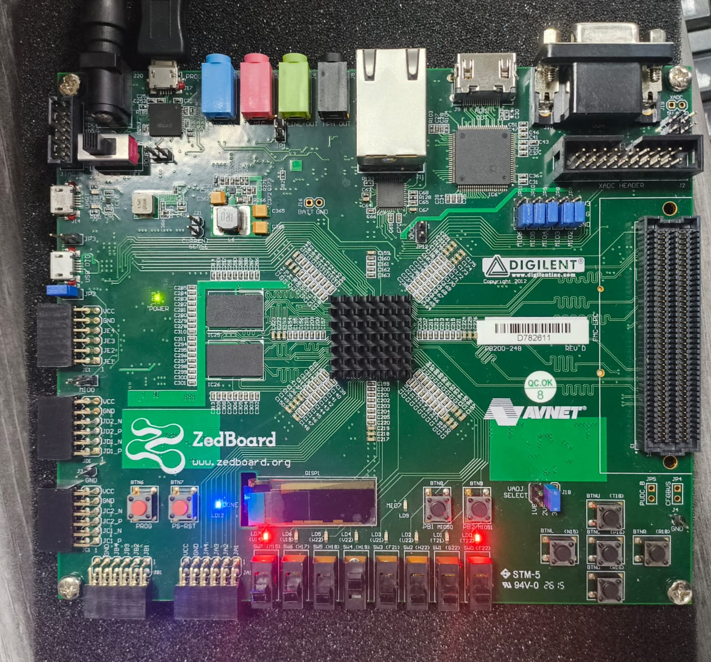
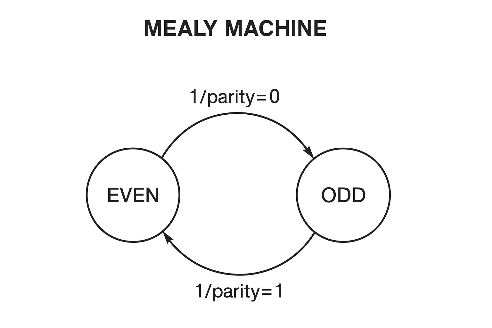
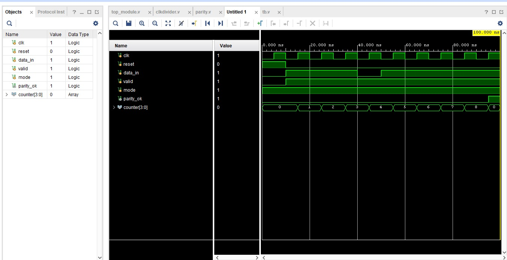
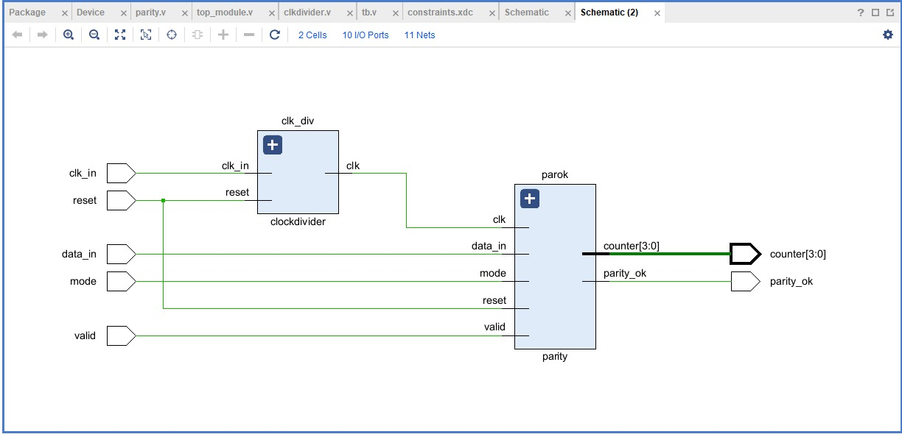

# 🌀 parity_checker_fsm

## 📌 Overview
This project implements a **Serial Parity Checker** using a **Finite State Machine (FSM)** in Verilog.  
It checks whether the number of `1`s in the received serial data stream is **even** or **odd** and outputs a parity status accordingly.  
The design supports both **even** and **odd** parity modes and validates the parity bit at the end of the sequence.

---
## 📜 Problem Statement
Design a serial **Parity Checker FSM** which:
- Checks if the number of 1's in the data stream is even or odd.
- Outputs **1** if the parity matches the expected mode, **0** otherwise.
- Supports **configurable parity modes**:
  - `mode = 0` → Even parity
  - `mode = 1` → Odd parity
- Validates parity bit at the end of the stream.

---

## ✨ Features

- **FSM Stages**:

  - `EVEN_STATE → ODD_STATE → EVEN_STATE` (keeps toggling as bits are received).

  - FSM behaves as a Mealy machine, meaning output depends on both state and input.

- **Functionality**:

  - Accepts serial input bits (data_in) one at a time.

  - Maintains a counter to track number of received bits.

  - Supports both even and odd parity modes (configurable via mode).

- **At the end of 8-bit sequence:**

  - parity_ok = 1 → if received parity matches expected

  - parity_ok = 0 → if mismatch detected

- **Inputs:**

  - clk – Clock input

  - reset – Resets FSM to initial state

  - data_in – Serial input bit

  - valid – Enables data sampling

  - mode – 0 = Even parity, 1 = Odd parity

- **Outputs:**

  - parity_ok – High if parity matches expectation

  - counter – Tracks number of received bits

---

## 🛠 Tools & Hardware
- Software: Vivado ML Edition (Standard) 2024.2
- Hardware: ZedBoard Zynq-7000 ARM / FPGA SoC Development Board
---

## 🔌 Inputs & Outputs
| Signal Name  | Direction | Description                              |
|--------------|-----------|------------------------------------------|
| `clk`        | Input     | System clock signal                      |
| `reset`      | Input     | Active-high reset                        |
| `data_in`    | Input     | Serial data input bit                    |
| `valid`      | Input     | High when input data is valid             |
| `mode`       | Input     | Parity mode (0 → Even, 1 → Odd)           |
| `parity_ok`  | Output    | High if parity matches expected mode      |
| `counter`    | Output    | 4-bit counter for tracking input length   |

---

## 🔄 FSM States
1. **EVEN_STATE** – Current number of 1's is even.
2. **ODD_STATE** – Current number of 1's is odd.

---
🔄 FSM Transition Description

The FSM always starts in the EVEN state.

If the input bit is 0, the FSM remains in the current state (no change).

If the input bit is 1, the FSM toggles its state:

From EVEN → ODD

From ODD → EVEN

This process repeats for every input bit in the sequence.

✅ In short:

0 = Stay in the same state

1 = Switch between EVEN ↔ ODD

## 📊 FSM State Diagram

---

## 📂 design.v
<pre>
module parity (
    input clk,
    input reset,
    input data_in,     
    input valid,       
    input mode,        
    output reg parity_ok,
    output reg [3:0] counter
    
);
     reg curr_state;
     reg next_state;

parameter EVEN_STATE = 1'b0;
parameter ODD_STATE  = 1'b1;

always @(*)
 begin
  next_state = curr_state;
    if (valid)
     begin
      if(data_in)
         begin 
         case (curr_state)
             EVEN_STATE : begin
                 next_state = ODD_STATE;
             end
             ODD_STATE : begin
                 next_state = EVEN_STATE;
             end
         endcase
       
         end
         else 
         begin
          next_state =curr_state;
         end
     end
 end

always @(posedge clk or posedge reset) 
begin
    if (reset) begin
        curr_state <= EVEN_STATE;
          counter <= 4'd0;
             parity_ok <= 1'b0;
    end else 
       begin
        if (valid) begin
          
            curr_state <= next_state;

          if (counter < 4'd8)
                counter <=counter + 1;

          if (counter == 4'd8)
             begin 
             
             curr_state <= EVEN_STATE;
               case(curr_state)
                 EVEN_STATE: 
                  begin
                     parity_ok <= (mode == 1'b0) ? 1'b1 : 1'b0; 
                  end
                 ODD_STATE: 
                   begin
                     parity_ok <= (mode == 1'b1) ? 1'b1 : 1'b0; 
                   end
               endcase
               
             end
             
            
        end
        else
             begin
                parity_ok <= 1'b0;
                counter <= 4'd0;
                curr_state <= EVEN_STATE;
             end
       end
end

endmodule
  </pre>

## 📂 testbench.v
<pre>`timescale 1ns/1ps

module tb();

    reg clk;
    reg reset;
    reg data_in;
    reg valid;
    reg mode;
    wire parity_ok;
    wire [3:0] counter;
    
    parity u1 (
        .clk(clk),
        .reset(reset),
        .data_in(data_in),
        .valid(valid),
        .mode(mode),
        .parity_ok(parity_ok),
        .counter(counter)
        
    );

    initial begin
        clk = 0;
        forever #5 clk  = ~clk;
    end
    initial begin
        
        reset = 1;
        valid = 0;
        mode = 0;        
        data_in = 0;
        #10;
        reset = 0;
        valid = 1;

        data_in = 1; #10;
        data_in = 1; #10;
        data_in = 0; #10;
        data_in = 1; #10;
        data_in = 0; #10;
        data_in = 0; #10;
        data_in = 0; #10;   
        data_in = 1; #10;
        
      #10 $finish;

    end
    initial begin
        $dumpfile("parity.vcd");
        $dumpvars(0, tb);
    end
    initial begin
                $monitor("time =%0t ,clk%b ,reset = %b,mode = %b,valid = %b, data_in =%b,counter = %d,parity_ok =%b", $time, clk, reset,mode,valid, data_in, counter, parity_ok);
    end

endmodule</pre>

---

## 🧪 Simulation

 

 ---

## ⚙️ Schematic View 
 
## ⚙️ Pin assignment

## ⚙️ File structure

## ⚙️pin_mapping in FPGA

## ⚙️power summary

## ⚙️Resource utilisation

## ⚙️Technology view

## 💫 Implementation

## EVEN PARITY CHECKER
[Even parity checker](https://drive.google.com/file/d/1byc-OG9huiHZshWdDYhuD5FeIiio-nlG/view?usp=sharing)

## ODD PARITY CHECKER
[Odd parity checker](https://drive.google.com/file/d/1WCapBTg2HTXZbWh_TGhe25JObeFLe8m5/view?usp=drive_link)

## 👥 Contributors

 Mohanapriyan P, Bannari Amman Institute Of Technology ( [linkedin](https://www.linkedin.com/in/mohanapriyan-p-b94962325/) )

 Naveenraj S, Bannari Amman Institute Of Technology ( [linkedin](https://www.linkedin.com/in/naveenraj07/) )
 
